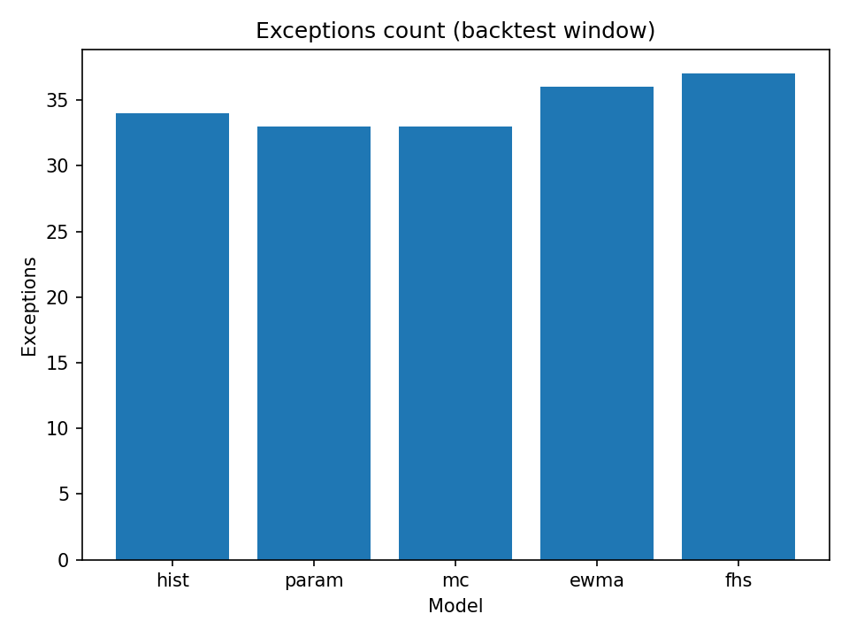
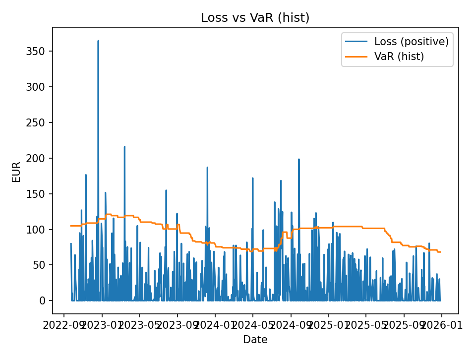

# Risk Report — compare_H1_1095d_alpha95_mcnormal_ewma_fhs

- Generated (UTC): **2025-12-28T20:14:35+00:00**
- Compare CSV: **compare_H1_1095d_alpha95_mcnormal_ewma_fhs.csv**
- Alpha: **0.95** (q=0.05)
- Sample (aligned days): **845**
- Range: **2022-09-23 00:00:00+00:00 → 2025-12-26 00:00:00+00:00**

## Latest Live Snapshot
_No snapshot found in data/snapshots (run live once to generate)._
## Backtest Summary (from compare CSV)
| Model | Exceptions | Traffic light (99%/250 only) |
|---|---:|---|
| hist | 34 | — |
| param | 33 | — |
| mc | 33 | — |
| ewma | 36 | — |
| fhs | 37 | — |

## Charts

