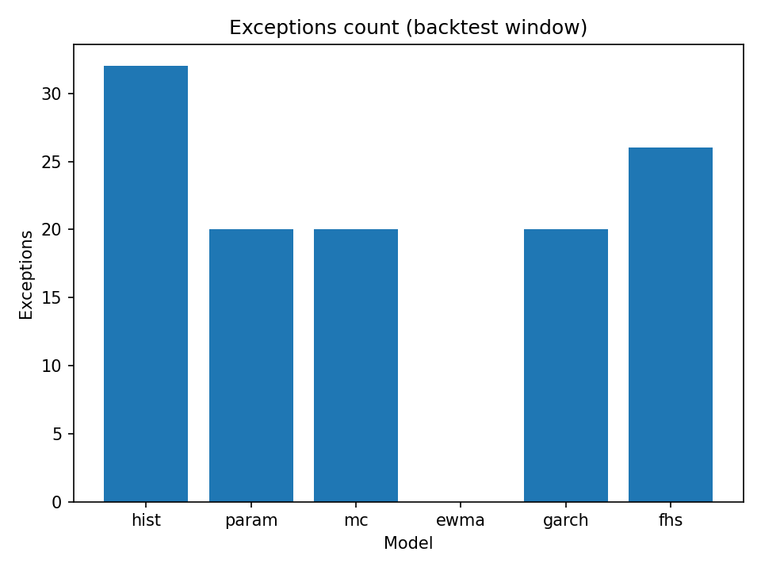
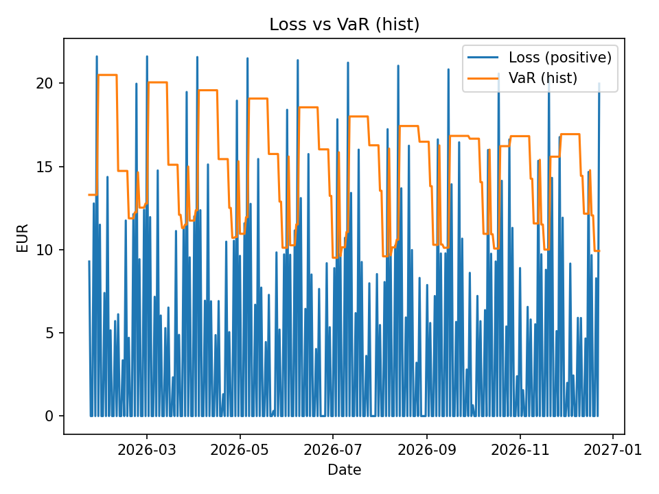

# Risk Report - FX_EUR_20k

- Generated (UTC): **2026-04-28T09:11:27+00:00**
- Compare CSV: **compare_H1_365d_alpha95_pffx_eur_20k_mcnormal_garch_t_ewma_fhs_20260428_090500_321357.csv**
- Preferred snapshot source: **mt5_live_bridge**
- Alpha: **0.95** (q=0.05)
- Sample (aligned days): **336**
- Range: **2026-01-22T00:00:00Z -> 2026-12-23T00:00:00Z**

## Portfolio Snapshot
- Snapshot time (UTC): **2026-04-28T09:11:24.417008+00:00**
- Snapshot source: **mt5_live_bridge**
- Capital status: **OK**
- Remaining capital: **-0.00 EUR**

### Holdings
| Symbol | Asset class | Side | Lots | Signed exposure | Exposure (base) | Unrealized PnL |
|---|---|---|---:|---:|---:|---:|
| EURUSD | cfd | BUY | 0.10 | 10,000.00 | 10,000.00 | 25.00 |
| USDJPY | indices_cfd | BUY | 0.11 | 10,092.67 | 10,092.67 | 25.00 |

### VaR / ES
| Model | VaR | ES |
|---|---:|---:|
| ewma | 26.79 | 33.59 |
| fhs | 18.12 | 21.95 |
| garch | 22.06 | 28.95 |
| hist | 16.77 | 19.05 |
| mc | 21.20 | 25.66 |
| param | 19.15 | 25.19 |

### Headline Risk Surface
| View | Model | Horizon | Confidence | VaR | ES | Status |
|---|---|---:|---:|---:|---:|---|
| Live 1D 95% | PARAM | 1d | 0.95 | 19.15 | 25.19 | thin_history |
| Live 1D 99% | PARAM | 1d | 0.99 | 29.00 | 33.90 | thin_history |
| Watch 5D 99% | PARAM | 5d | 0.99 | -8.94 | -6.74 | thin_history |
| Governance ES 10D 97.5% | PARAM | 10d | 0.97 | -26.04 | -21.78 | thin_history |
| Governance 10D 99% | PARAM | 10d | 0.99 | -21.91 | -18.08 | thin_history |
| Stressed ES 10D 97.5% | HIST | 10d | 0.97 | -21.56 | -20.64 | thin_history |
| Stressed ES 10D 99% | HIST | 10d | 0.99 | -20.64 | -20.29 | thin_history |

### Risk Contributions
- Attribution model: **PARAM**

| Symbol | Asset class | Exposure | cVaR | cES | iVaR | iES | Contrib ES |
|---|---|---:|---:|---:|---:|---:|---:|
| USDJPY | indices_cfd | 10,092.67 | 17.92 | 23.14 | 13.32 | 17.36 | 91.8% |
| EURUSD | cfd | 10,000.00 | 1.23 | 2.05 | 0.01 | 0.53 | 8.2% |

| Asset class | Symbols | Exposure | cVaR | cES | iVaR | iES | Contrib ES |
|---|---:|---:|---:|---:|---:|---:|---:|
| indices_cfd | 1 | 10,092.67 | 17.92 | 23.14 | 13.32 | 17.36 | 91.8% |
| cfd | 1 | 10,000.00 | 1.23 | 2.05 | 0.01 | 0.53 | 8.2% |

### Stress Surface
| Scenario | VaR | ES |
|---|---:|---:|
| Volatility regime shift | -21.56 | -20.64 |
| FX directional down shock | 1,981.11 | 1,981.78 |
| Correlated multi-asset drawdown | 3,000.59 | 3,001.81 |

| Historical window | Worst loss | Tail mean loss | End date |
|---|---:|---:|---|
| 1d | 20.29 | 19.05 | 2026-11-20T00:00:00+00:00 |
| 5d | -11.95 | -12.78 | 2026-12-25T00:00:00+00:00 |
| 10d | -28.96 | -29.77 | 2027-01-01T00:00:00+00:00 |

### Live Risk Nowcast
- Regime: **volatile**
- Scale factor: **1.15**
- 1D 99% nowcast: VaR **33.35**, ES **38.99**
- Governance nowcast: VaR **-23.74**, ES **-23.34**

### Market Microstructure
- Market regime: **volatile**
- Average spread: **2.20 bps**
- Widest spread: **2.56 bps** on **USDJPY**
- Tick quality: **healthy**
- Healthy/stale/incomplete symbols: **2 / 0 / 0**

### PnL Explain
- Realized: **12.50** | Unrealized: **50.00** | Swap: **0.00**
- Commission/fee: **-0.50 / 0.00** | Estimated spread cost: **442.00**

## Backtest Summary (from compare CSV)
| Model | Rank | Exceptions | Rate | p(UC) | p(CC) | Signal | Verdict |
|---|---:|---:|---|---:|---:|---|---|
| PARAM | 1 | 20 | 5.95% / 5.00% | 0.4362 | 0.2213 | PASS | PASS |
| GARCH | 1 | 20 | 5.95% / 5.00% | 0.4362 | 0.2213 | PASS | PASS |
| MC | 3 | 20 | 5.95% / 5.00% | 0.4362 | 0.2213 | PASS | PASS |
| EWMA | 4 | 0 | 0.00% / 5.00% | 0.0000 | 0.0000 | UC FAIL | FAIL |
| FHS | 5 | 26 | 7.74% / 5.00% | 0.0324 | 0.0124 | UC+IND FAIL | FAIL |
| HIST | 6 | 32 | 9.52% / 5.00% | 0.0007 | 0.0001 | UC+IND FAIL | FAIL |

## Model Validation
- Champion model: **PARAM**
- Champion verdict: **PASS** | Traffic light: **99%/250 only**
- Rank 1 statistical tie: **PARAM / GARCH** share the same ranking key (score, breach profile and coverage distance).
- Statistical threshold (p-value): **5.0%**

| Model | Rank | Score | Exceptions | Rate (actual / expected) | p(UC) | p(IND) | p(CC) | ES tail n | ES shortfall ratio | ES breach rate | ES Acerbi n | ES Acerbi z | ES Acerbi p | Signal | Basel light | Verdict |
|---|---:|---:|---:|---|---:|---:|---:|---:|---:|---:|---:|---:|---:|---|---|---|
| PARAM | 1 | 51.39 | 20/336 | 5.95% / 5.00% | 0.4362 | 0.1205 | 0.2213 | 20 | 0.896 | 0.00% | 336 | 0.292 | 0.7703 | PASS | 99%/250 only | PASS |
| GARCH | 1 | 51.39 | 20/336 | 5.95% / 5.00% | 0.4362 | 0.1205 | 0.2213 | 20 | 0.896 | 0.00% | 336 | 0.292 | 0.7703 | PASS | 99%/250 only | PASS |
| MC | 3 | 51.39 | 20/336 | 5.95% / 5.00% | 0.4362 | 0.1205 | 0.2213 | 20 | 0.903 | 10.00% | 336 | 0.327 | 0.7436 | PASS | 99%/250 only | PASS |
| EWMA | 4 | 15.00 | 0/336 | 0.00% / 5.00% | 0.0000 | 1.0000 | 0.0000 | 0 | n/a | n/a | 336 | n/a | n/a | UC FAIL | 99%/250 only | FAIL |
| FHS | 5 | 21.86 | 26/336 | 7.74% / 5.00% | 0.0324 | 0.0403 | 0.0124 | 26 | 1.106 | 80.77% | 336 | 2.192 | 0.0284 | UC+IND FAIL | 99%/250 only | FAIL |
| HIST | 6 | 4.46 | 32/336 | 9.52% / 5.00% | 0.0007 | 0.0105 | 0.0001 | 32 | 0.980 | 56.25% | 336 | 2.689 | 0.0072 | UC+IND FAIL | 99%/250 only | FAIL |

_ES tail diagnostics are measured on VaR exceedance observations (tail observations where portfolio loss is greater than VaR)._

### Model Governance Surface
- Statistical threshold (p-value): **5.0%**
- Surface champions (live/reporting): **PARAM / PARAM**
- PASS/WARN/FAIL points: **3 / 0 / 3** (total **6**)
- Sampled points: **6 / 6** | Under sample floor: **0**
- Statistical pass rate: **50.0%**
- Traffic lights G/Y/R: **0 / 0 / 0**
- Coverage rejections (sampled points only): **3** | Independence rejections: **2** | Conditional rejections: **3**
- Backtest confidence: **HIGH** (score **100.0/100**)
- Confidence note: **All validation points satisfy the configured sample-size floors.**

### Multi-Horizon Validation
- Overall horizon verdict: **FAIL**
| Horizon | Champion | Verdict | Pass rate | PASS/WARN/FAIL | Coverage fails | Independence fails | Conditional fails | Confidence |
|---:|---|---|---:|---|---:|---:|---:|---|
| 1d | PARAM | FAIL | 50.0% | 3/0/3 | 3 | 2 | 3 | HIGH (100.0/100) |

## Alerts
- [WARN] KUPIEC_REJECTED: hist fails unconditional coverage at 5%.
- [WARN] CC_REJECTED: hist fails conditional coverage at 5%.
- [BREACH] VALIDATION_ES_BREACH_RATE_BREACH: hist ES breach rate is elevated (56.25%) on tail observations.
- [BREACH] VALIDATION_ES_ACERBI_BREACH: hist ES Acerbi backtest rejects calibration (p=0.0072, z=2.689).
- [WARN] KUPIEC_REJECTED: ewma fails unconditional coverage at 5%.
- [WARN] CC_REJECTED: ewma fails conditional coverage at 5%.
- [WARN] KUPIEC_REJECTED: fhs fails unconditional coverage at 5%.
- [WARN] CC_REJECTED: fhs fails conditional coverage at 5%.
- [WARN] VALIDATION_ES_SHORTFALL_WARN: fhs ES shortfall ratio is above warning threshold (1.106).
- [BREACH] VALIDATION_ES_BREACH_RATE_BREACH: fhs ES breach rate is elevated (80.77%) on tail observations.
- [WARN] VALIDATION_ES_ACERBI_WARN: fhs ES Acerbi backtest is close to rejection (p=0.0284).
- [BREACH] VALIDATION_GOVERNANCE_FAIL: Validation governance surface has 3 failing points out of 6.
- [BREACH] VALIDATION_SURFACE_COVERAGE_FAIL: Unconditional coverage fails on 3 validation-surface points.
- [BREACH] VALIDATION_SURFACE_CONDITIONAL_FAIL: Conditional coverage fails on 3 validation-surface points.
- [WARN] VALIDATION_SURFACE_INDEPENDENCE_FAIL: Independence test fails on 2 validation-surface points.
- [BREACH] VALIDATION_HORIZON_FAIL: Validation horizon 1d is FAIL with 3 failing points out of 6.

## Charts

## Decision History

- 2026-04-28T09:07:31.143990+00:00: EURUSD -> ACCEPT (requested -11000.0, approved -11000.0, model param)
- 2026-04-28T09:06:57.131011+00:00: EURUSD -> ACCEPT (requested 1500.0, approved 1500.0, model param)
- 2026-04-28T09:05:54.973594+00:00: EURUSD -> ACCEPT (requested -10000.0, approved -10000.0, model param)
- 2026-04-28T09:05:24.899917+00:00: EURUSD -> ACCEPT (requested 5000.0, approved 5000.0, model param)

## Capital History

- 2026-04-28T09:10:56.066240+00:00: consumed=25.189936399769934 remaining=-4.440892098500626e-16 status=OK source=mt5_live_bridge
- 2026-04-28T09:10:23.078927+00:00: consumed=25.189936399769934 remaining=-4.440892098500626e-16 status=OK source=mt5_live_bridge
- 2026-04-28T09:07:51.794777+00:00: consumed=30.70580192069888 remaining=4.440892098500626e-16 status=OK source=mt5_live_bridge
- 2026-04-28T09:04:21.462752+00:00: consumed=19.04690524058567 remaining=0.0 status=OK source=mt5_live_bridge
- 2026-04-28T09:03:22.212467+00:00: consumed=19.04690524058567 remaining=0.0 status=OK source=mt5_live_bridge

## Audit Trail

- 2026-04-28T09:11:26.729552+00:00: api report.auto_refresh daily_report#21
- 2026-04-28T09:11:16.072031+00:00: system reconciliation.snapshot reconciliation_snapshot#
- 2026-04-28T09:11:15.380062+00:00: api mt5.reconcile risk_snapshot#12
- 2026-04-28T09:10:29.603135+00:00: api snapshot.run risk_snapshot#11
- 2026-04-28T09:10:15.836978+00:00: api mt5.reconcile risk_snapshot#10
- 2026-04-28T09:10:06.729615+00:00: api mt5.reconcile risk_snapshot#9
- 2026-04-28T09:08:02.415993+00:00: operator reconciliation.acknowledge reconciliation_mismatch#
- 2026-04-28T09:07:52.047896+00:00: system reconciliation.snapshot reconciliation_snapshot#
